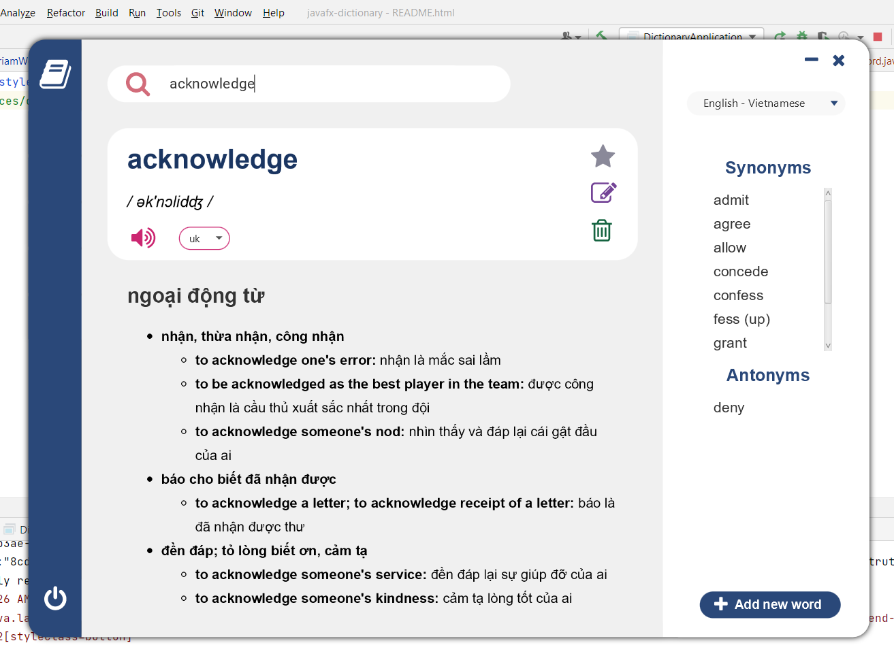
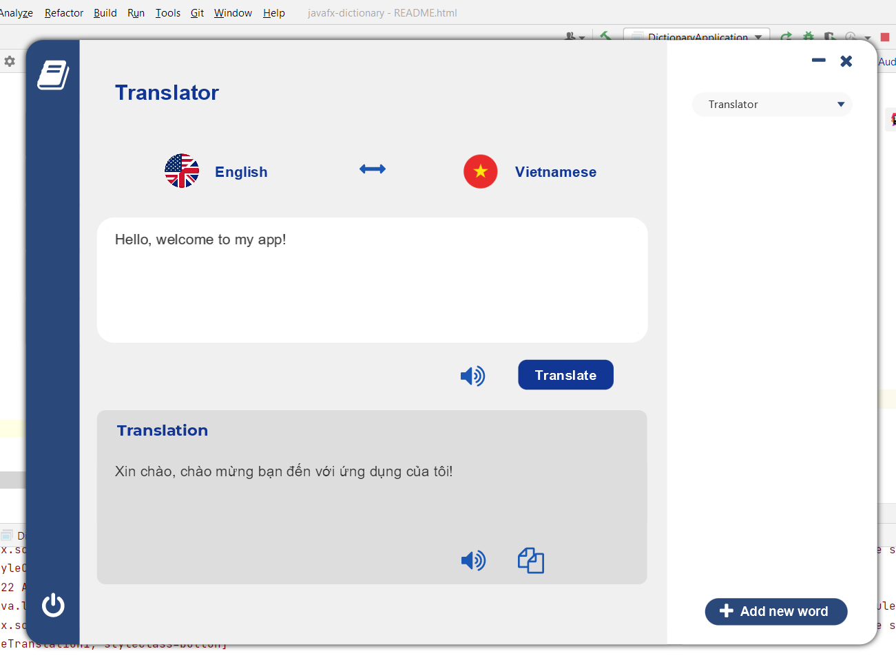

<!DOCTYPE html>
<html lang="en" xmlns="http://www.w3.org/1999/xhtml">

<h1 align="center" style="color: #113694"> javafx-dictionary </h1>

<em>JavaFX - ControlFX - SQLite - FontAwesome</em>

<h2>Intro</h2>
<i>A simple dictionary application on desktop written in Java.</i>

<h2>Datasets</h2>
<ul>
    <li><a href="https://www.informatik.uni-leipzig.de/~duc/Dict/install.html">SQLite database converted</a> <i>en-vi.db</i></li>
</ul>
<h2>APIs</h2>
<ul>
    <li><a href="https://www.dictionaryapi.com/">Merriam-Webster API</a></li>
    <li>Google Translate API</li>
    <li><a href="http://www.voicerss.org/api/">VoiceRSS API (TTS)<a/></li>
</ul>

<h2>Screenshots</h2>

</html>
